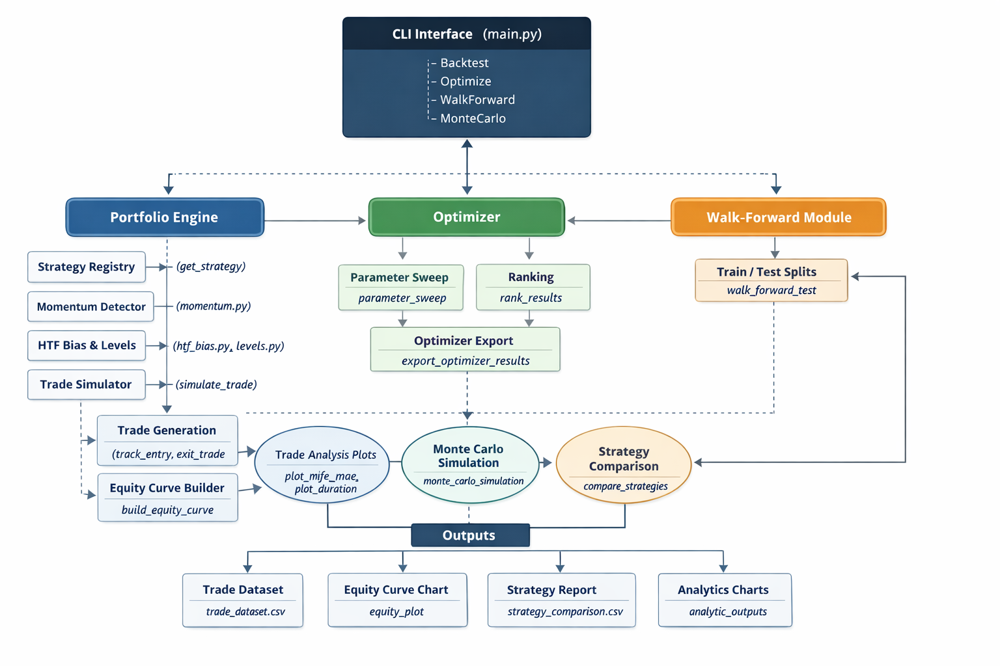

# Trading Strategy Backtester

A modular algorithmic trading research platform built in Python for designing, testing, and evaluating trading strategies using historical market data.


##  Features

- Multi-strategy portfolio backtesting
- Strategy comparison engine
- Monte Carlo simulation for robustness testing
- Parameter optimization (grid search)
- Walk-forward testing
- Trade analytics (MFE, MAE, duration, R-distribution)
- Equity curve + drawdown tracking
- Trade dataset export for further analysis
- Command-line interface (CLI)


##  Project Purpose

This project was built to simulate how professional quantitative trading systems are developed and tested. It focuses on **robustness, modularity, and research workflows** rather than just profitability.

## Architecture



##  Installation

```bash
git clone <your-repo-link>
cd Trading-Strategy-Backtester
pip install -r requirements.txt
